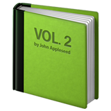
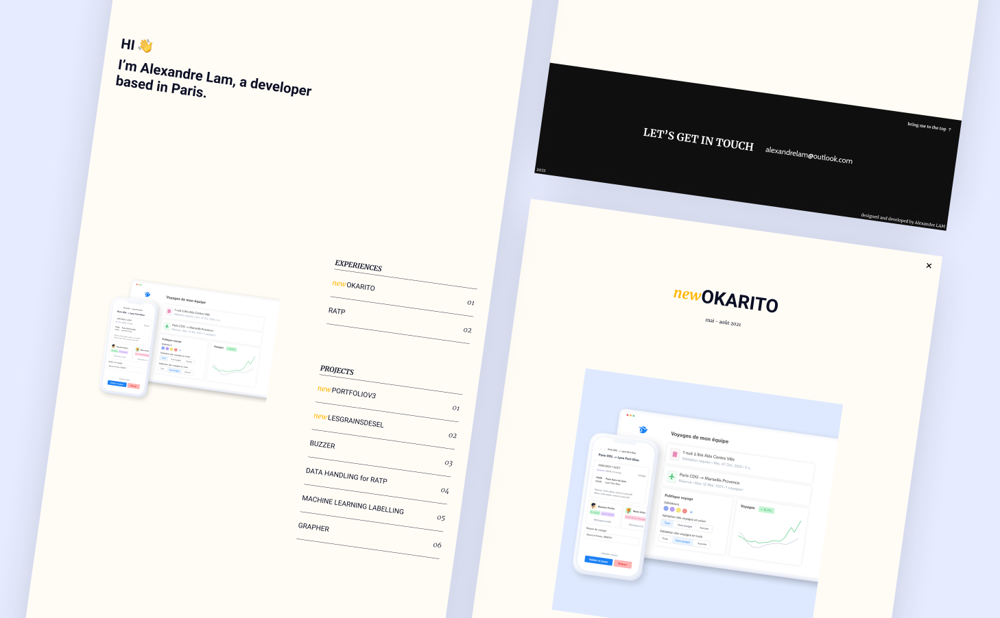

<div id="top"></div>
<!--
*** Thanks for checking out the Best-README-Template. If you have a suggestion
*** that would make this better, please fork the repo and create a pull request
*** or simply open an issue with the tag "enhancement".
*** Don't forget to give the project a star!
*** Thanks again! Now go create something AMAZING! :D
-->

<!-- PROJECT SHIELDS -->
<!--
*** I'm using markdown "reference style" links for readability.
*** Reference links are enclosed in brackets [ ] instead of parentheses ( ).
*** See the bottom of this document for the declaration of the reference variables
*** for contributors-url, forks-url, etc. This is an optional, concise syntax you may use.
*** https://www.markdownguide.org/basic-syntax/#reference-style-links
-->

[![Contributors][contributors-shield]][contributors-url]
[![Forks][forks-shield]][forks-url]
[![Stargazers][stars-shield]][stars-url]
[![Issues][issues-shield]][issues-url]
[![MIT License][license-shield]][license-url]
[![LinkedIn][linkedin-shield]][linkedin-url]

<!-- PROJECT LOGO -->
<br />
<div align="center">
  <a href="https://github.com/alexandrelam/portfolio">
    
  </a>

  <h3 align="center"><i>new</i> Portfolio</h3>

  <p align="center">
    Repo for my new portfolio I made with ❤️
    <br />
    <br />
    <a href="https://github.com/alexandrelam/portfolio">View Site</a>
    ·
    <a href="https://github.com/alexandrelam/portfolio/issues">Report Bug</a>
    ·
    <a href="https://github.com/alexandrelam/portfolio/issues">Request Feature</a>
  </p>
</div>

<!-- TABLE OF CONTENTS -->
<details>
  <summary>Table of Contents</summary>
  <ol>
    <li>
      <a href="#about-the-project">About The Project</a>
      <ul>
        <li><a href="#built-with">Built With</a></li>
      </ul>
    </li>
    <li>
      <a href="#getting-started">Getting Started</a>
      <ul>
        <li><a href="#prerequisites">Prerequisites</a></li>
        <li><a href="#installation">Installation</a></li>
      </ul>
    </li>
    <li><a href="#roadmap">Roadmap</a></li>
    <li><a href="#contributing">Contributing</a></li>
    <li><a href="#license">License</a></li>
    <li><a href="#contact">Contact</a></li>
    <li><a href="#acknowledgments">Acknowledgments</a></li>
  </ol>
</details>

<!-- ABOUT THE PROJECT -->

## About The Project

<a href="https://github.com/alexandrelam/portfolio">
  
</a>

This is my new portfolio inspired by [Awwwards sites](https://www.awwwards.com/). During those last 5 months, I tried to design and develop the best site I could to show my work.

- Here are some things I kept in mind while designing the portfolio:
- Use a simple color scheme
- Be mindful about fonts
- Create white space to let the user breathe and direct the attention to the right place
- Put my work first, no useless info
- Easy navigation to avoid losing time
- Support for multiple languages

<p align="right">(<a href="#top">back to top</a>)</p>

### Built With

Here are the major frameworks/libraries/tools used to bootstrap my portfolio.

- [Vue.js](https://vuejs.org/)
- [Nuxt.js](https://nuxtjs.org/)
- [GSAP](https://greensock.com/gsap/)
- [Figma](https://www.figma.com/)

<p align="right">(<a href="#top">back to top</a>)</p>

<!-- GETTING STARTED -->

## Getting Started

### Prerequisites

- Use node 12
- Use yarn

### Installation

1. Clone project

```sh
git clone https://github.com/alexandrelam/portfolio
```

2. Install dependencies

```sh
yarn install
```

3. Run project

```sh
yarn dev
```

<p align="right">(<a href="#top">back to top</a>)</p>

<!-- ROADMAP -->

## Roadmap

- [ ] Add more content to detail page
- [ ] Fix cursor not clicking on buttons

See the [open issues](https://github.com/alexandrelam/portfolio/issues) for a full list of proposed features (and known issues).

<p align="right">(<a href="#top">back to top</a>)</p>

<!-- CONTRIBUTING -->

## Contributing

Contributions are what make the open source community such an amazing place to learn, inspire, and create. Any contributions you make are **greatly appreciated**.

If you have a suggestion that would make this better, please fork the repo and create a pull request. You can also simply open an issue with the tag "enhancement".
Don't forget to give the project a star! Thanks again!

1. Fork the Project
2. Create your Feature Branch (`git checkout -b feature/AmazingFeature`)
3. Commit your Changes (`git commit -m 'Add some AmazingFeature'`)
4. Push to the Branch (`git push origin feature/AmazingFeature`)
5. Open a Pull Request

<p align="right">(<a href="#top">back to top</a>)</p>

<!-- LICENSE -->

## License

Distributed under the GPL-3.0 License. See `LICENSE.txt` for more information.

<p align="right">(<a href="#top">back to top</a>)</p>

<!-- CONTACT -->

## Contact

Email:

```
alexandrelam@outlook.com
```

Project Link: [https://github.com/alexandrelam/portfolio](https://github.com/alexandrelam/portfolio)

<p align="right">(<a href="#top">back to top</a>)</p>

<!-- ACKNOWLEDGMENTS -->

## Acknowledgments

- [Awwwards](https://www.awwwards.com/)

<p align="right">(<a href="#top">back to top</a>)</p>

<!-- MARKDOWN LINKS & IMAGES -->
<!-- https://www.markdownguide.org/basic-syntax/#reference-style-links -->

[contributors-shield]: https://img.shields.io/github/contributors/alexandrelam/portfolio.svg?style=for-the-badge
[contributors-url]: https://github.com/alexandrelam/portfolio/graphs/contributors
[forks-shield]: https://img.shields.io/github/forks/alexandrelam/portfolio.svg?style=for-the-badge
[forks-url]: https://github.com/alexandrelam/portfolio/network/members
[stars-shield]: https://img.shields.io/github/stars/alexandrelam/portfolio.svg?style=for-the-badge
[stars-url]: https://github.com/alexandrelam/portfolio/stargazers
[issues-shield]: https://img.shields.io/github/issues/alexandrelam/portfolio.svg?style=for-the-badge
[issues-url]: https://github.com/alexandrelam/portfolio/issues
[license-shield]: https://img.shields.io/github/license/alexandrelam/portfolio.svg?style=for-the-badge
[license-url]: https://github.com/alexandrelam/portfolio/blob/master/LICENSE.txt
[linkedin-shield]: https://img.shields.io/badge/-LinkedIn-black.svg?style=for-the-badge&logo=linkedin&colorB=555
[linkedin-url]: https://www.linkedin.com/in/alexandre-lam-74787b191/
